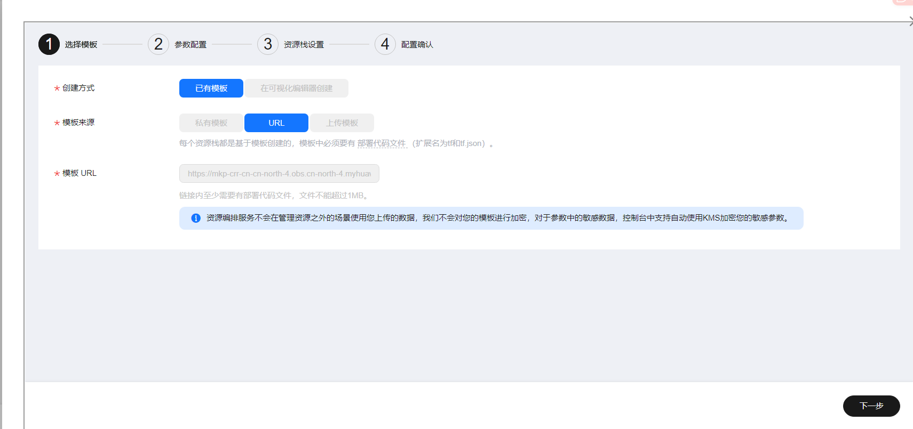
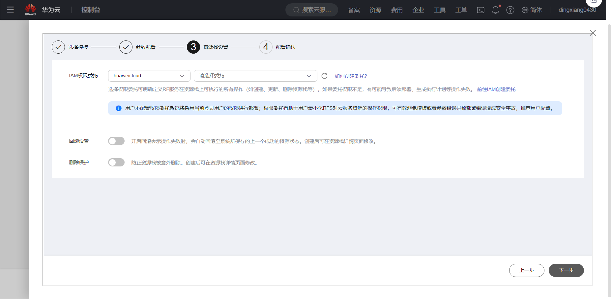
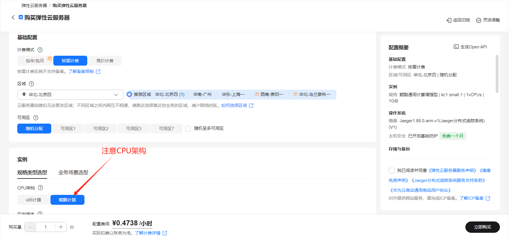
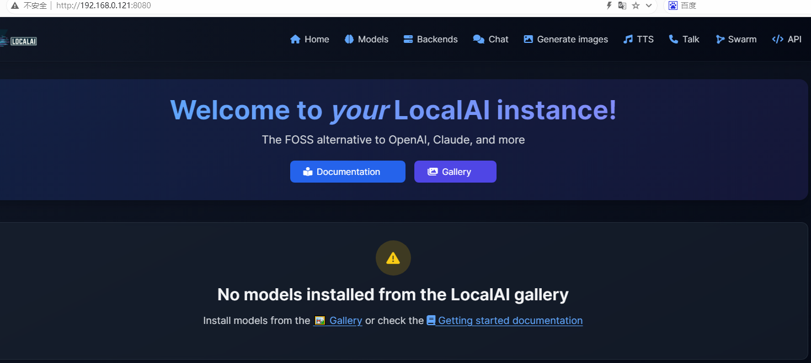

# LocalAI Tool User Guide  
## Product Link  
[LocalAI Platform](https://marketplace.huaweicloud.com/intl/hidden/contents/a097f0fb-aa22-4ca4-bc22-c6e3faf0c88e)  

## Product Description  
LocalAI is your complete AI stack for running AI models locally. It’s designed to be simple, efficient, and accessible, providing a drop-in replacement for OpenAI’s API while keeping your data private and secure. 

## Product Purchase  
You can search for "LocalAI" in the cloud marketplace.  
For **Region** and **Specifications**, use the recommended configurations. The **Purchase Method** can be selected based on your needs—**Pay-as-you-go** for short-term use or **Monthly/Yearly** for long-term use. After confirming the configuration, click **"Buy Now"**.  

  

### Deploy Directly Using RFS Template  
  
Fill in the required fields and click **Next**.  
  
  
After creating the deployment plan, click **Confirm**.  
  
  
Click **Deploy** to execute the plan.  
  
The message **"Apply required resource success."** indicates that the resources have been successfully created.  
  

### ECS Console Configuration  
#### Preparations  

Before configuring the ECS console, you need to set up **Security Group Rules** in advance.  

> **Security Group Rules Configuration:**  
> - Allow inbound traffic on port **8080**, ensuring the source IP range includes your client IP; otherwise, access will be denied.  
> - Allow inbound traffic on port **22** for CloudShell connections to enable console debugging.  
> - Enable full outbound traffic.  

#### Creating an ECS  

After completing the preparations, navigate to the [ECS Purchase Page](https://support.huaweicloud.com/qs-ecs/ecs_01_0103.html) via the ECS console. Configure the ECS resources as shown below:  

**Select CPU Architecture**  
  
**Select Server Specifications**  
  
**Select Image**  
  
Fill in other parameters according to your actual needs, then click **Buy Now**.  
  

> **Important Notes:**  
> - You can create a **VPC** yourself.  
> - Select the **Security Group** configured in the [**Preparations**](#preparations) section.  
> - For **Elastic Public IP**, select **"Purchase Now"** and choose **"Pay-by-Traffic"** (recommended). Set the bandwidth to **5Mbit/s**.  
> - **Advanced Configuration** requires custom data injection, so **Login Credentials** cannot be set as **"Password"**—select **"Set After Creation"** instead.  
> - Other settings can be left as default or configured as needed.  

## Product Usage  
### Logging into the Server to Start the LocalAI Docker Container  
- After accessing the system, run the following command:  
```shell  
cd ~/localai  
docker run -p 8080:8080 -v $PWD/models:/models -ti --rm localai/localai:v3.0.0 --models-path /models  
```  
  

- Access the LocalAI platform via browser:  
**http://yourIp:8080/**  
  

### Downloading Models & Loading References (LocalAI Manual)  
[LocalAI Manual](https://localai.io/docs/getting-started/models/)
