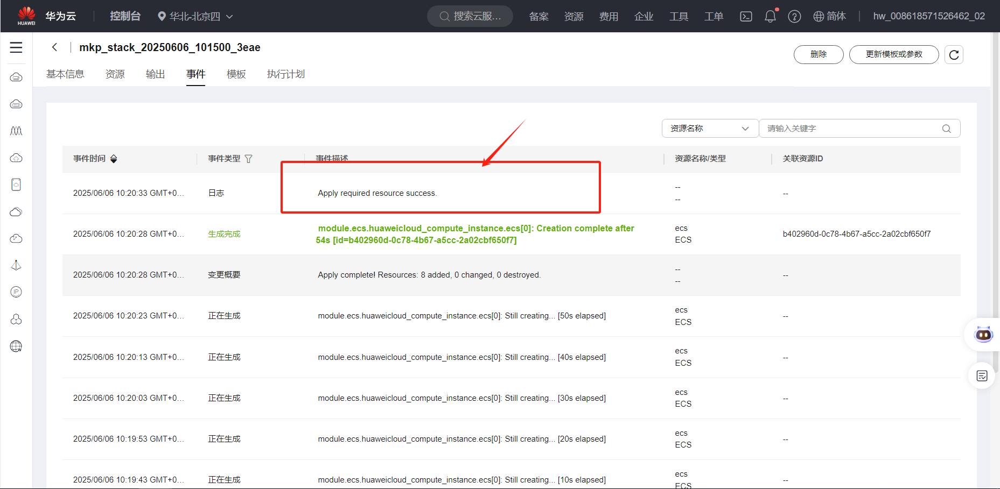
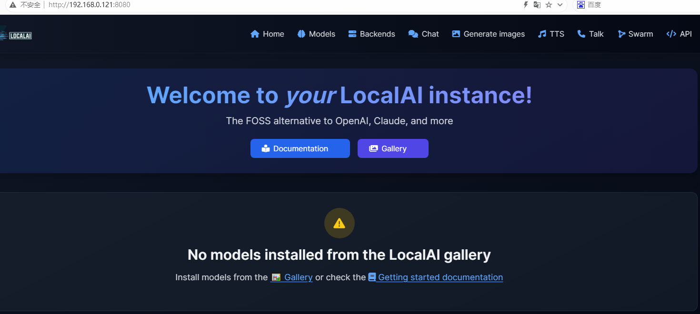

# LocalAI 平台使用指南
## 商品连接
[LocalAI平台](https://marketplace.huaweicloud.com/contents/c2624f6f-2e5e-4e0e-813a-832bd101101e#productid=OFFI1137707809154215936)

## 商品说明
LocalAI是您完整的AI堆栈，用于在本地运行AI模型。它旨在简单，高效且易于使用，为OpenAI的API提供了替换，同时保持数据私密和安全。

## 商品购买
您可以在云商店搜索“LocalAI”。<br>
其中，地域、规格、按照推荐配置使用，购买方式根据您的需求选择按需/按月/按年，短
期使用推荐按需，长期使用推荐按月/按年，确认配置后点击“立即购买”。


### 使用 RFS 模板直接部署

必填项填写后，点击 下一步


创建直接计划后，点击 确定


点击部署，执行计划

如下图“Apply required resource success. ”即为资源创建完成


### ECS控制台配置
#### 准备工作

在使用ECS控制台配置前，需要您提前配置好 **安全组规则**。

> **安全组规则的配置如下：**
> - 入方向规则放通端口8080，源地址内必须包含您的客户端ip，否则无法访问
> - 入方向规则放通 CloudShell 连接实例使用的端口 `22`，以便在控制台登录调试
> - 出方向规则一键放通

#### 创建ECS

前提工作准备好后，选择 ECS 控制台配置跳转到[购买ECS](https://support.huaweicloud.com/qs-ecs/ecs_01_0103.html) 页面，ECS 资源的配置如下图所示：

选择CPU架构

选择服务器规格

选择镜像

其他参数根据实际请客进行填写，填写完成之后，点击立即购买即可


> **值得注意的是：**
- VPC 您可以自行创建
- 安全组选择 [**准备工作**](#准备工作) 中配置的安全组；
- 弹性公网IP选择现在购买，推荐选择“按流量计费”，带宽大小可设置为5Mbit/s；
- 高级配置需要在高级选项支持注入自定义数据，所以登录凭证不能选择“密码”，选择创建后设置；
- 其余默认或按规则填写即可。

 ## 商品使用
 ### 登录服务器启动LocalAI的Docker容器
- 进入系统后通过命令
```shell
cd ~/localai
docker run -p 8080:8080 -v $PWD/models:/models -ti --rm localai/localai:v3.0.0 --models-path /models
```


- 通过浏览器登录 LocalAI 平台  http://yourIp:8080/  



### 下载模型与加载参考LocalAI手册
[LocalAI手册](https://localai.io/docs/getting-started/models/)